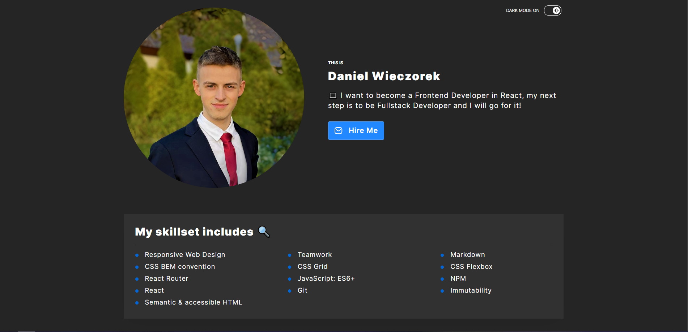

# Personal Homepage - website

Website created with React.js

## Table of Contents
* [Demo](#🌐-demo)
* [Description](#📄-description)
* [Used Technologies](#🛠️-used-technologies)
* [Avaiable Scripts](#available-scripts)

### 🌐 Demo
Link to site: https://virusse7.github.io/Personal-Homepage/

### 📄 Description

At the start we have button to switch themes between light and dark with ternary operator and theme provider. Below we have small section with main information and description with skills, to show them i used map function.
Also we have a portfolio which take repositories from github and map them to tiles with links to demo and code. Footer is with address information and links to socials. 
 Website is responsive in three ways: mobile, desktop, tablet horizontal.

Created project with own website where my skills are described to search first job. 

### 🛠️ Used technologies
- React.js
- Styled-components
- Global Style
- Theme styles with provider
- Redux

# Getting Started with Create React App

This project was bootstrapped with [Create React App](https://github.com/facebook/create-react-app).

## Available Scripts

In the project directory, you can run:

### `npm start`

Runs the app in the development mode.\
Open [http://localhost:3000](http://localhost:3000) to view it in your browser.

The page will reload when you make changes.\
You may also see any lint errors in the console.

### `npm run build`

Builds the app for production to the `build` folder.\
It correctly bundles React in production mode and optimizes the build for the best performance.

The build is minified and the filenames include the hashes.\
Your app is ready to be deployed!

See the section about [deployment](https://facebook.github.io/create-react-app/docs/deployment) for more information.
